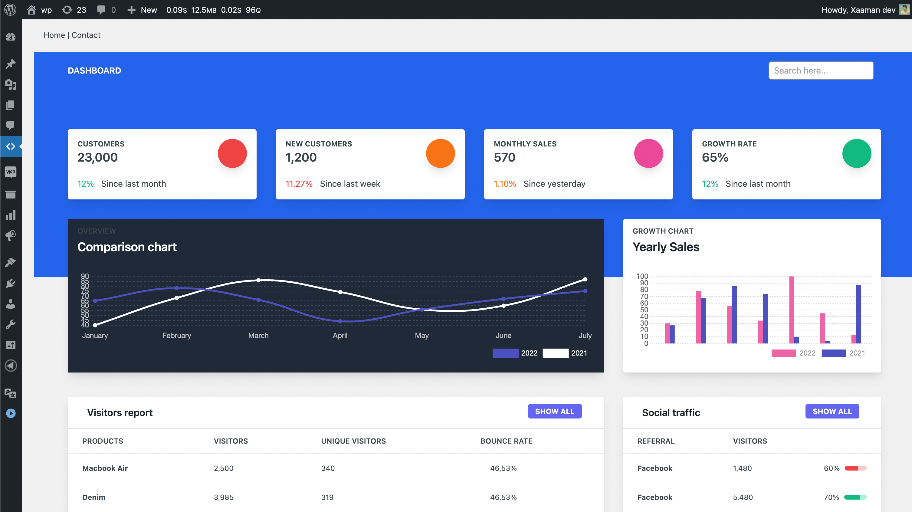

# WP Plugin Vue Boilerplate (Vite Build)
This is a Customizable sample WordPress Plugin which is developed as a single page app on backend with Vue js and Tailwind custom build css. and you don't have to reload page all the time.

Caption: <i>Dummy dashboard with custom build vue + tailwind setup (Vite realtime environment)</i> 

# How to use ?

- Just clone/fork this repository
- Check the package.json file
- command: `npm i`
- command: `npm run watch` for development and for production: `npm run production`

On production you only need
- assets
- includes
- wp-plugin-with-vue-tailwind.php (plugin Entry file)

If you face any issue feel free to let me know. :)

 

## Vue + Element UI auto command boilerplate

You can check another boilerplate plugin with vue js and element UI, You can create your own project using simple command line on that project within 2 mint.

Check it here: https://github.com/hasanuzzamanbe/wp-boilerplate-plugin-with-vuejs

### Other Setups you may Use
* WordPress Plugin with Vue 3, tailwind (Laravel Mix Build) [https://github.com/hasanuzzamanbe/wp-plugin-with-vue-tailwind]
* WordPress Plugin with Vue 2, Element UI (Laravel Mix Build) [https://github.com/hasanuzzamanbe/wp-boilerplate-plugin-with-vuejs]

